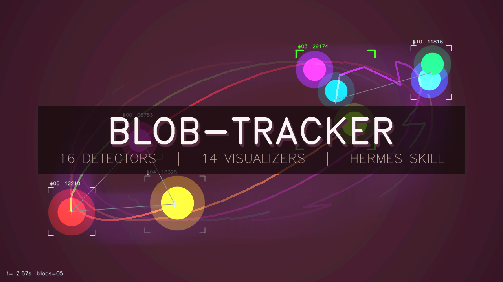

# blob-tracker

<p align="center">
  
</p>

A **Hermes Agent skill** (also Claude-Code-skill compatible) that renders any
video with audio-reactive blob tracking in **16 detector flavors** and
**14 visualization flavors** — combine freely. The skill fills in any
missing input on demand: bring your own video and audio, or have it find
a public-domain clip on the Internet Archive and compose an ambient
soundtrack.

Built for the **Nous Research / Kimi Creative Hackathon (May 2026)**,
Kimi Track. All LLM/vision calls go to Kimi (Moonshot AI) `kimi-k2.6`.

## Highlights

- **16 detector flavors** — `motion-diff` · `mog2` · `knn` · `flow` ·
  `color-hsv` · `color-cluster` · `simple-blob` · `dog` · `circles` ·
  `saliency-fine` · `saliency-spec` · `csrt` · `edge` · `accumulation` ·
  `watershed` · `contour-area`
- **14 visualization flavors** — `bbox` · `corner-ticks` · `crosshair` ·
  `centroid-trail` · `network` · `letters` · `glyphs` · `cctv-zoom` ·
  `silhouette` · `outline` · `voronoi` · `convex-hull` · `heatmap` ·
  `spatial-echo` (each blob bbox shows pixels sampled from elsewhere)
- **13 optional glitch postfx** — chromatic aberration, NTSC chroma
  desync, kolorizer LUT, sync jitter, ripple, mosaic, scanlines, slit
  scan, feedback, lagfun, threshold bands, edge glow, luma rotate
- **Audio reactivity** — RMS / kick / high / onset features modulate
  every visualizer's intensity per frame
- **Auto-fill missing inputs** — bring `--video` + `--audio`, or use
  `--find-video` to search the Internet Archive, or `--compose-music`
  to synthesise a soundtrack, or `--brief "..."` for full-auto
- **Kimi for creative judgement** — query expansion, vision-based clip
  picking, music key/mode/bpm director, optional `--auto-flavor`
  detector + viz selection from a frame thumbnail

## Install

Direct from this repo, into Hermes:

```bash
mkdir -p ~/.hermes/skills/creative
git clone https://github.com/Apolotary/blob-tracker.git \
    ~/.hermes/skills/creative/blob-tracker

pip install -r ~/.hermes/skills/creative/blob-tracker/requirements.txt
```

For Claude Code, swap the path:
```bash
git clone https://github.com/Apolotary/blob-tracker.git \
    ~/.claude/skills/blob-tracker
```

`ffmpeg` must be on your `$PATH` (`brew install ffmpeg`).

The skill uses `opencv-contrib-python` for the saliency + CSRT-tracker
detectors. If you already have plain `opencv-python` installed, replace
it: `pip uninstall opencv-python && pip install opencv-contrib-python`.

## Run

```bash
export MOONSHOT_API_KEY=sk-...        # only when using --brief / --compose-music / --auto-flavor

# 1. Pure: existing video + existing audio
python scripts/render.py --video clip.mp4 --audio track.wav \
    --detector mog2 --viz centroid-trail,network --output out.mp4

# 2. Compose music for an existing video
python scripts/render.py --video clip.mp4 --compose-music \
    --music-brief "warm contemplative ambient pad" \
    --viz silhouette,outline --output out.mp4

# 3. Find video on IA, bring your own audio
python scripts/render.py --find-video "lunar surface NASA" \
    --audio mytrack.wav --viz heatmap,corner-ticks --output out.mp4

# 4. Full auto from a creative brief
python scripts/render.py --brief "1920s botanical, dreamy ambient pad" \
    --auto-flavor --dual-format

# 5. The "spatial echo" — blob bbox shows mirrored content from elsewhere
python scripts/render.py --video clip.mp4 \
    --detector mog2 --viz spatial-echo,corner-ticks \
    --viz-params '{"spatial-echo":{"mode":"rotate","time_shift_frames":12}}' \
    --output out.mp4
```

Output goes to `--output` (single mp4) or to
`$BLOB_OUT_DIR/<slug>/` (multi-file run with intermediate `winner.json`,
`audio.json`, `audio.wav`, etc.). Default `BLOB_OUT_DIR` is
`~/blob-tracker`.

## Use in Hermes Agent chat

Once installed, the skill becomes a slash command:

```
/blob-tracker --video clip.mp4 --detector mog2 --viz centroid-trail,network
```

Or in natural conversation:

```
hermes chat --toolsets skills -q "blob-track this clip with the heatmap viz"
hermes chat --toolsets skills -q "find a NASA clip and make a media-art piece"
```

Full install paths and Hermes config in [`INSTALL.md`](INSTALL.md).

## Modules

| Script | Uses Kimi | What it does |
|---|---|---|
| `scripts/render.py` | text+vision (opt) | Main entry. Composes everything. |
| `scripts/detectors.py` | — | Registry of 16 detector flavors. |
| `scripts/visualizers.py` | — | Registry of 14 viz flavors. |
| `scripts/postfx.py` | — | Registry of 13 optional glitch primitives. |
| `scripts/audio_features.py` | — | RMS / kick / high / onset extractor. |
| `scripts/video_search.py` | text+vision | IA search + Kimi pick. Standalone CLI. |
| `scripts/compose_music.py` | text | Brief → music spec → 5-layer numpy synth. |
| `scripts/prepare_source.py` | — | Download + energy-scout + square-crop. |
| `scripts/kimi_client.py` | — | OpenAI-compatible Kimi client. |

Each helper is independently CLI-invokable for debugging or one-off use.

## Why Kimi for the creative decisions

- **Picking a clip from search results** is *taste*, not retrieval —
  Kimi's vision model judges six tiny IA thumbnails and picks the one
  that will yield rich 26 seconds.
- **Choosing musical mode/bpm from a brief** is a small-but-creative
  judgement; `kimi-k2.6` does it well at sub-cent cost per call.
- **Auto-flavor detector + viz selection** lets Kimi-vision look at
  a frame thumbnail and recommend the right blob-tracking parameters
  for that footage.

All Kimi calls go through `kimi_client.py` — swap the model ID via
`KIMI_MODEL=...` env if you want to try a different K2 variant.

## Reference docs

- [`references/detector-flavors.md`](references/detector-flavors.md) —
  every detector with parameters and recommended use case
- [`references/viz-flavors.md`](references/viz-flavors.md) —
  every visualization with parameters and combination tips
- [`references/postfx-glossary.md`](references/postfx-glossary.md) —
  glitch primitive parameters and audio mappings
- [`references/audio-design.md`](references/audio-design.md) —
  how the 5-layer ambient synth is built and what Kimi's mood map controls

## Hackathon submission

- The repository **is** the skill. Drop into `~/.hermes/skills/creative/`
  and the agent has a new `/blob-tracker` slash command.
- All footage in any output is public-domain (Internet Archive
  Prelinger / NASA / NARA collections by default).
- All AI calls go to **Kimi (Moonshot AI)** — query expansion, vision
  picks, music director, auto-flavor selection.

## License

MIT — see [`LICENSE`](LICENSE). Reusing this code requires retaining
the copyright and license notice.
